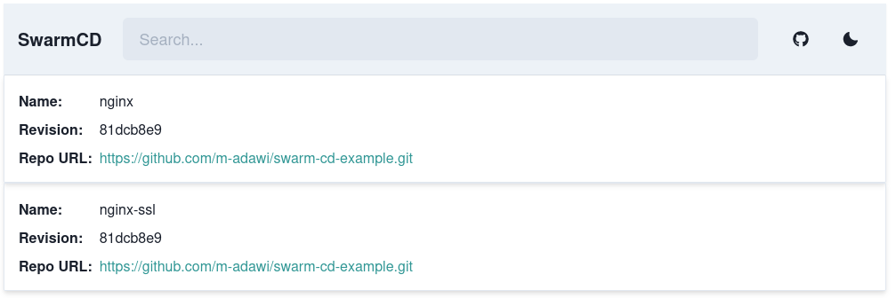

# SwarmCD

A declarative GitOps and Continuous Deployment tool for Docker Swarm.

Inspired by [ArgoCD](https://argo-cd.readthedocs.io/en/stable/).



## Usage

In this example, we use SwarmCD to deploy the stack in the repo
[swarm-cd-example](https://github.com/m-adawi/swarm-cd-example) to a docker swarm cluster.

First we add the repo to the file `repos.yaml`

```yaml
# repos.yaml
swarm-cd-example:
  url: "https://github.com/m-adawi/swarm-cd-example.git"
```

Then we define the stack in `stacks.yaml`

```yaml
# stacks.yaml
nginx:
  repo: swarm-cd-example
  branch: main
  compose_file: nginx/compose.yaml
```

And finally, we deploy SwarmCD to the cluster
using the following docker-compose file:

```yaml
# docker-compose.yaml
version: '3.7'
services:
  swarm-cd:
    image: ghcr.io/m-adawi/swarm-cd:latest
    deploy:
      placement:
        constraints:
          - node.role == manager
    volumes:
      - /var/run/docker.sock:/var/run/docker.sock:ro
      - ./repos.yaml:/app/repos.yaml:ro
      - ./stacks.yaml:/app/stacks.yaml:ro
```

Run this on a swarm manager node:

```bash
docker stack deploy --compose-file docker-compose.yaml swarm-cd
```

This will start SwarmCD, it will periodically check the stack repo
for new changes, pulling them and updating the stack.

## Manage Encrypted Secrets Using SOPS

You can use [sops](https://github.com/getsops/sops) to encrypt secrets in git repos and
have SwarmCD decrypt them before deploying or updating your stacks.

The stack `nginx-ssl` in the
[example repo](https://github.com/m-adawi/swarm-cd-example)
has two secret files under `nginx-ssl/secrets/` directory.
You can configure SwarmCD files to decrypt them by
setting the property`sops_files` in a stack defenition.

```yaml
# stacks.yaml
nginx-ssl:
    repo: swarm-cd-example
    branch: main
    compose_file: nginx-ssl/compose.yaml
    sops_files: 
      - nginx-ssl/secrets/www.example.com.crt
      - nginx-ssl/secrets/www.example.com.key
```

Then you need to set the SOPS environment variables that are required
to decrypt the files.
Depending on the backend you used for sops encryption, the configuration
can be a little different:
- If you used [age](https://github.com/FiloSottile/age)
to encrypt, you have to mount the age key file to SwarmCD
and set the environment variable SOPS `SOPS_AGE_KEY_FILE`
to the path of the key file.
- If you used gpg, you have to mount the file containing your gpg private
key in the container, and set the environment variable
`SOPS_GPG_PRIVATE_KEY_FILE` to the path of the gpg private key file.
It is also possible to directly provide the gpg key in the `SOPS_GPG_PRIVATE_KEY`
environment variable.

See the following docker-compose example.

```yaml
version: '3.7'
services:
  swarm-cd:
    image: ghcr.io/m-adawi/swarm-cd:latest
    deploy:
      placement:
        constraints:
          - node.role == manager
    secrets:
      - source: age
        target: /secrets/age.key # or /secrets/private.gpg
    environment:
      - SOPS_AGE_KEY_FILE=/secrets/age.key
      # or
      - SOPS_GPG_PRIVATE_KEY_FILE=/secrets/private.gpg
    volumes:
      - /var/run/docker.sock:/var/run/docker.sock:ro
      - ./repos.yaml:/app/repos.yaml:ro
      - ./stacks.yaml:/app/stacks.yaml:ro
secrets:
  age:
    file: age.key
```

This way, SwarmCD will decrypt the files each time before it updates
the stack.

### Automatic SOPS secrets detection

Instead of specifying the paths of every single secrets you need to decrypt,
you can use the `sops_secrets_discovery: true` option:

- in the `config.yaml` file to enable it globally
- in the `stacks.yaml` file for the individual stacks.

Please note that:

- if the global setting is set to `true`, it ignores individual stacks overrides.
- if the stack-level setting is set to `true`, it ignores the `sops_files` setting altogether.

## Connect SwarmCD to a remote docker socket

You can use the `DOCKER_HOST` environment variable to point SwarmCD to a remote docker socket,
be it in the same swarm or a different host.

In the following example `docker-socket-proxy` talks directly to the host socket proxy,
and SwarmCD connects to it:

```yaml
version: '3.7'

services:
  socket_proxy:
    image: tecnativa/docker-socket-proxy:0.2.0
    deploy:
      placement:
        constraints: 
          - node.role == manager
    volumes: 
      - /var/run/docker.sock:/var/run/docker.sock:ro
    environment:
      TZ: Europe/Rome
      INFO: 1
      SERVICES: 1
      NETWORKS: 1
      SECRETS: 1
      CONFIGS: 1
      POST: 1

  swarm-cd:
    image: ghcr.io/m-adawi/swarm-cd:latest
    environment:
      DOCKER_HOST: tcp://socket_proxy:2375
    configs:
      - source: stacks
        target: /app/stacks.yaml
        mode: 0400
      - source: repos
        target: /app/repos.yaml
        mode: 0400

configs:
  stacks:
    file: ./stacks.yaml
  repos:
    file: ./repos.yaml
```

## Give SwarmCD access to private registries

You can pass the authentication to private container registries via the `~/.docker/config.json` file.

First, encode your credentials with base64 (here we use `printf` to avoid the trailing newline):

```shell
printf 'username:password' | base64
```

Then create the docker config file like this:

```json
// docker-config.json
{
    "auths": {
        "my.registry.example": {
            "auth": "(base64 output here)"
        }
    }
}
```

Lastly, add the config file as secret and mount it to `/root/.docker/config.json`:

```yaml
# docker-compose.yaml
version: '3.7'
services:
  swarm-cd:
    image: ghcr.io/m-adawi/swarm-cd:latest
    deploy:
      placement:
        constraints:
          - node.role == manager
    volumes:
      - /var/run/docker.sock:/var/run/docker.sock:ro
      - ./repos.yaml:/app/repos.yaml:ro
      - ./stacks.yaml:/app/stacks.yaml:ro
    secrets:
      - source: docker-config
        target: /root/.docker/config.json
secrets:
  docker-config:
    file: docker-config.json
```
Note: if running swarmcd as a user other than root, modify the docker config mount path to match.

## Documentation

See [docs](https://github.com/m-adawi/swarm-cd/blob/main/docs).
